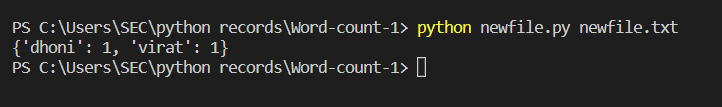

# Word-count
## AIM:
To write a python program for getting the word count from a text.
## EQUIPEMENT'S REQUIRED: 
PC
Anaconda - Python 3.7
## ALGORITHM: 
### Step 1:
import sys library

### Step 2:
initialize a variable count = {} 
 
### Step 3: 
open the file using open)sys.argv[1],'r') as f:

### Step 4:
use for loops  

### Step 5: 
use if else to count the words

### Step 6:
end the program 

## PROGRAM:

Developed by: Soundariyan M N

Ref: 22008347

```python
import sys
count = {}
with open(sys.argv[1], 'r') as f:
    for line in f:
        for word in line.split():
            if word not in count:
                count[word]= 1
             else:
                count[word] +=1
print(count)
f.close() 
```                  

### OUTPUT:



## RESULT:
Thus the program is written to find the word count from a text.
